## Vishal Kumar

AI engineer building production-oriented AI systems across agents, RAG, Production ML, streaming inference, and LLM evaluation.

I am a B.Tech CSE student at IIIT Nagpur, graduating in 2027. My work is focused on systems that can be evaluated, deployed, and inspected: multi-agent workflows, grounded retrieval, fine-tuning pipelines, safety guardrails, and low-latency ML inference.

**Current focus:** agentic AI, multi-agent systems, RAG, reinforcement learning, LLM evaluation, production ML inference.

## Proof

| Signal | Result | What it shows |
|---|---:|---|
| AMD Slingshot AI Promptathon | #1 / 823 | Prompting, evaluation, fast system design |
| HackerRank Orchestrate May 2026 | Top 1.2% (#159 / 12,885) | Grounded agent workflows across 48 countries |
| Wunder Fund LOB Predictorum | Top 2.4% (#120 / 4,917) | Streaming ML, quantitative modeling, inference optimization |
| ArtPark CodeForge, IISc Bangalore | 1st runner-up | Hackathon execution and product thinking |
| Triagegeist Clinical AI | OOF QWK 0.9987 | Clinical feature engineering and model validation |

## Selected Systems

| Project | Scope | Stack | Links |
|---|---|---|---|
| CrisisOps | Multi-agent SRE training environment with procedural incidents, tool-based agents, automated judging, and RL-style reward design. | Python, LangGraph, OpenEnv, GRPO, QLoRA, FastAPI, Hugging Face | [Repo](https://github.com/Vk2245/CrisisOps-Multi-Agent-SRE-Training-via-OpenEnv), [Live](https://huggingface.co/spaces/Vk224/crisisops-env) |
| Triagegeist | Clinical triage prediction system with hierarchical safety logic, 200+ engineered clinical features, and gradient-boosted ensemble modeling. | XGBoost, LightGBM, CatBoost, Production ML, feature engineering | [Repo](https://github.com/Vk2245/Triagegeist-vk2245) |
| LOB Predictorum | Streaming-native limit order book prediction system built after diagnosing batch-to-live degradation. | PyTorch, BiGRU, TimeMixer, InfoNCE SSL, ONNX, INT8 quantization | [Repo](https://github.com/Vk2245/-Vk224-Wunder-Challenge-LOB-Predictorium) |
| WasteWatch AI | AI-native civic reporting platform with vision classification, model fallback, API integrations, and bilingual voice workflows. | Gemini, Groq, FastAPI, React, voice AI | [Repo](https://github.com/Vk2245/WasteWatchAI), [Live](https://wastewatch224.onrender.com) |
| CivicPath | Non-partisan election assistant for Indian voters using multilingual guidance, fact checking, and Google services. | Gemini, Google Cloud Run, Maps, Speech, multilingual NLP | [Repo](https://github.com/Vk2245/CivicPath-AI-India), [Live](https://civicpath-85167217171.us-central1.run.app) |
| DevBoost AI | Agentic code analysis tool with explain, test, and fix modes, structured output contracts, and streaming responses. | React, Vite, FastAPI, LangChain, IBM Bot API | [Repo](https://github.com/Vk2245/DevBoost-AI-IBM-Bob-Code-Analysis-Platform) |

## Engineering Areas

**AI systems:** agent orchestration, tool use, RAG, prompt contracts, hallucination controls, LLM evaluation, fine-tuning.

**ML and research:** Production ML, time-series modeling, ranking metrics, self-supervised learning, model compression, ablation-driven iteration.

**Production:** FastAPI services, React interfaces, Dockerized apps, cloud deployment, API integrations, streaming inference, observability-minded design.

## Research Interests

- Reliable multi-agent systems with measurable task success.
- RAG systems that cite evidence and fail safely when evidence is weak.
- Reinforcement learning and reward design for tool-using agents.
- Clinical and civic AI systems where false confidence is more dangerous than abstention.
- Low-latency inference for streaming and decision-support workloads.

## Contact

I am open to AI engineering internships, research engineering work, and founder-led teams building serious applied AI systems.

- GitHub: [github.com/Vk2245](https://github.com/Vk2245)
- LinkedIn: [linkedin.com/in/vishal-kumar-7a74462a0](https://linkedin.com/in/vishal-kumar-7a74462a0)
- Kaggle: [kaggle.com/vk2245](https://kaggle.com/vk2245)
- Hugging Face: [huggingface.co/Vk224](https://huggingface.co/Vk224)
- Email: [vk224official@gmail.com](mailto:vk224official@gmail.com)
